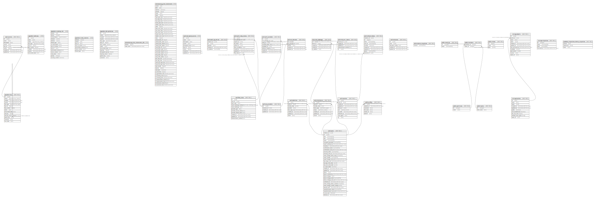

# postgres

## Tables

| Name | Columns | Comment | Type |
| ---- | ------- | ------- | ---- |
| [pgsodium.key](pgsodium.key.md) | 14 | This table holds metadata for derived keys given a key_id and key_context. The raw key is never stored. | BASE TABLE |
| [pgsodium.valid_key](pgsodium.valid_key.md) | 9 |  | VIEW |
| [pgsodium.masking_rule](pgsodium.masking_rule.md) | 14 |  | VIEW |
| [pgsodium.mask_columns](pgsodium.mask_columns.md) | 7 |  | VIEW |
| [pgsodium.decrypted_key](pgsodium.decrypted_key.md) | 14 |  | VIEW |
| [extensions.pg_stat_statements_info](extensions.pg_stat_statements_info.md) | 2 |  | VIEW |
| [extensions.pg_stat_statements](extensions.pg_stat_statements.md) | 43 |  | VIEW |
| [vault.secrets](vault.secrets.md) | 8 | Table with encrypted `secret` column for storing sensitive information on disk. | BASE TABLE |
| [vault.decrypted_secrets](vault.decrypted_secrets.md) | 9 |  | VIEW |
| [auth.audit_log_entries](auth.audit_log_entries.md) | 5 | Auth: Audit trail for user actions. | BASE TABLE |
| [auth.flow_state](auth.flow_state.md) | 11 | stores metadata for pkce logins | BASE TABLE |
| [auth.identities](auth.identities.md) | 8 | Auth: Stores identities associated to a user. | BASE TABLE |
| [auth.instances](auth.instances.md) | 5 | Auth: Manages users across multiple sites. | BASE TABLE |
| [auth.mfa_amr_claims](auth.mfa_amr_claims.md) | 5 | auth: stores authenticator method reference claims for multi factor authentication | BASE TABLE |
| [auth.mfa_challenges](auth.mfa_challenges.md) | 5 | auth: stores metadata about challenge requests made | BASE TABLE |
| [auth.mfa_factors](auth.mfa_factors.md) | 8 | auth: stores metadata about factors | BASE TABLE |
| [auth.refresh_tokens](auth.refresh_tokens.md) | 9 | Auth: Store of tokens used to refresh JWT tokens once they expire. | BASE TABLE |
| [auth.saml_providers](auth.saml_providers.md) | 8 | Auth: Manages SAML Identity Provider connections. | BASE TABLE |
| [auth.saml_relay_states](auth.saml_relay_states.md) | 9 | Auth: Contains SAML Relay State information for each Service Provider initiated login. | BASE TABLE |
| [auth.schema_migrations](auth.schema_migrations.md) | 1 | Auth: Manages updates to the auth system. | BASE TABLE |
| [auth.sessions](auth.sessions.md) | 10 | Auth: Stores session data associated to a user. | BASE TABLE |
| [auth.sso_domains](auth.sso_domains.md) | 5 | Auth: Manages SSO email address domain mapping to an SSO Identity Provider. | BASE TABLE |
| [auth.sso_providers](auth.sso_providers.md) | 4 | Auth: Manages SSO identity provider information; see saml_providers for SAML. | BASE TABLE |
| [auth.users](auth.users.md) | 34 | Auth: Stores user login data within a secure schema. | BASE TABLE |
| [public.countries](public.countries.md) | 2 |  | BASE TABLE |
| [public.members](public.members.md) | 2 |  | BASE TABLE |
| [public.movies](public.movies.md) | 3 |  | BASE TABLE |
| [public.profiles](public.profiles.md) | 6 |  | BASE TABLE |
| [public.sportmans](public.sportmans.md) | 2 |  | BASE TABLE |
| [public.teams](public.teams.md) | 2 |  | BASE TABLE |
| [storage.buckets](storage.buckets.md) | 10 |  | BASE TABLE |
| [storage.migrations](storage.migrations.md) | 4 |  | BASE TABLE |
| [storage.objects](storage.objects.md) | 11 |  | BASE TABLE |
| [supabase_migrations.schema_migrations](supabase_migrations.schema_migrations.md) | 3 |  | BASE TABLE |

## Stored procedures and functions

| Name | ReturnType | Arguments | Type |
| ---- | ------- | ------- | ---- |
| storage.get_size_by_bucket | record |  | FUNCTION |
| auth.role | text |  | FUNCTION |
| extensions.uuid_generate_v1mc | uuid |  | FUNCTION |
| extensions.uuid_generate_v3 | uuid | namespace uuid, name text | FUNCTION |
| extensions.uuid_generate_v4 | uuid |  | FUNCTION |
| auth.uid | uuid |  | FUNCTION |
| auth.email | text |  | FUNCTION |
| auth.jwt | jsonb |  | FUNCTION |
| extensions.grant_pg_graphql_access | event_trigger |  | FUNCTION |
| pgsodium.crypto_aead_det_noncegen | bytea |  | FUNCTION |
| pgsodium.crypto_sign_detached | bytea | message bytea, key bytea | FUNCTION |
| pgsodium.crypto_kx_client_session_keys | crypto_kx_session | client_pk bytea, client_sk bytea, server_pk bytea | FUNCTION |
| pgsodium.crypto_pwhash_saltgen | bytea |  | FUNCTION |
| pgsodium.crypto_kx_server_session_keys | crypto_kx_session | server_pk bytea, server_sk bytea, client_pk bytea | FUNCTION |
| pgsodium.crypto_auth_hmacsha512_keygen | bytea |  | FUNCTION |
| pgsodium.crypto_box_new_seed | bytea |  | FUNCTION |
| pgsodium.crypto_sign_new_seed | bytea |  | FUNCTION |
| pgsodium.derive_key | bytea | key_id bigint, key_len integer DEFAULT 32, context bytea DEFAULT '\x7067736f6469756d'::bytea | FUNCTION |
| pgsodium.crypto_aead_ietf_keygen | bytea |  | FUNCTION |
| pgsodium.pgsodium_derive | bytea | key_id bigint, key_len integer DEFAULT 32, context bytea DEFAULT decode('pgsodium'::text, 'escape'::text) | FUNCTION |
| pgsodium.randombytes_new_seed | bytea |  | FUNCTION |
| pgsodium.crypto_secretbox_keygen | bytea |  | FUNCTION |
| pgsodium.crypto_auth_keygen | bytea |  | FUNCTION |
| pgsodium.crypto_box_noncegen | bytea |  | FUNCTION |
| pgsodium.crypto_shorthash_keygen | bytea |  | FUNCTION |
| pgsodium.crypto_generichash_keygen | bytea |  | FUNCTION |
| pgsodium.crypto_kdf_keygen | bytea |  | FUNCTION |
| pgsodium.crypto_kx_new_keypair | crypto_kx_keypair |  | FUNCTION |
| pgsodium.crypto_kx_new_seed | bytea |  | FUNCTION |
| pgsodium.crypto_kx_seed_new_keypair | crypto_kx_keypair | seed bytea | FUNCTION |
| pgsodium.crypto_auth_hmacsha256_keygen | bytea |  | FUNCTION |
| pgsodium.crypto_box_new_keypair | crypto_box_keypair |  | FUNCTION |
| pgsodium.crypto_sign_new_keypair | crypto_sign_keypair |  | FUNCTION |
| pgsodium.crypto_sign_init | bytea |  | FUNCTION |
| pgsodium.crypto_sign_update | bytea | state bytea, message bytea | FUNCTION |
| pgsodium.randombytes_random | int4 |  | FUNCTION |
| pgsodium.crypto_secretbox_noncegen | bytea |  | FUNCTION |
| pgsodium.crypto_aead_ietf_noncegen | bytea |  | FUNCTION |
| pgsodium.crypto_secretstream_keygen | bytea |  | FUNCTION |
| pgsodium.crypto_stream_xchacha20_keygen | bytea |  | FUNCTION |
| pgsodium.crypto_stream_xchacha20_noncegen | bytea |  | FUNCTION |
| pgsodium.crypto_cmp | bool | text, text | FUNCTION |
| pgsodium.crypto_signcrypt_new_keypair | crypto_signcrypt_keypair |  | FUNCTION |
| pgsodium.crypto_aead_det_encrypt | bytea | message bytea, additional bytea, key bytea, nonce bytea DEFAULT NULL::bytea | FUNCTION |
| pgsodium.crypto_aead_det_decrypt | bytea | ciphertext bytea, additional bytea, key bytea, nonce bytea DEFAULT NULL::bytea | FUNCTION |
| pgsodium.crypto_aead_det_encrypt | bytea | message bytea, additional bytea, key_id bigint, context bytea DEFAULT '\x7067736f6469756d'::bytea, nonce bytea DEFAULT NULL::bytea | FUNCTION |
| pgsodium.crypto_aead_det_decrypt | bytea | message bytea, additional bytea, key_id bigint, context bytea DEFAULT '\x7067736f6469756d'::bytea, nonce bytea DEFAULT NULL::bytea | FUNCTION |
| pgsodium.version | text |  | FUNCTION |
| pgsodium.has_mask | bool | role regrole, source_name text | FUNCTION |
| pgsodium.mask_columns | record | source_relid oid | FUNCTION |
| pgsodium.create_mask_view | void | relid oid, debug boolean DEFAULT false | FUNCTION |
| pgsodium.crypto_sign_update_agg2 | bytea | cur_state bytea, initial_state bytea, message bytea | FUNCTION |
| pgsodium.crypto_sign_update_agg | bytea | message bytea | a |
| pgsodium.create_key | valid_key | key_type pgsodium.key_type DEFAULT 'aead-det'::pgsodium.key_type, name text DEFAULT NULL::text, raw_key bytea DEFAULT NULL::bytea, raw_key_nonce bytea DEFAULT NULL::bytea, parent_key uuid DEFAULT NULL::uuid, key_context bytea DEFAULT '\x7067736f6469756d'::bytea, expires timestamp with time zone DEFAULT NULL::timestamp with time zone, associated_data text DEFAULT ''::text | FUNCTION |
| pgsodium.crypto_sign_update_agg | bytea | state bytea, message bytea | a |
| pgsodium.crypto_box_open | bytea | ciphertext bytea, nonce bytea, public bytea, secret bytea | FUNCTION |
| pgsodium.quote_assoc | text | text, boolean DEFAULT false | FUNCTION |
| pgsodium.crypto_box_seal | bytea | message bytea, public_key bytea | FUNCTION |
| pgsodium.crypto_kdf_derive_from_key | bytea | subkey_size integer, subkey_id bigint, context bytea, primary_key uuid | FUNCTION |
| pgsodium.crypto_aead_det_encrypt | bytea | message bytea, additional bytea, key_uuid uuid | FUNCTION |
| pgsodium.crypto_aead_det_decrypt | bytea | message bytea, additional bytea, key_uuid uuid | FUNCTION |
| pgsodium.encrypted_columns | text | relid oid | FUNCTION |
| pgsodium.crypto_box_seal_open | bytea | ciphertext bytea, public_key bytea, secret_key bytea | FUNCTION |
| pgsodium.crypto_sign_final_create | bytea | state bytea, key bytea | FUNCTION |
| pgsodium.get_key_by_id | valid_key | uuid | FUNCTION |
| pgsodium.get_key_by_name | valid_key | text | FUNCTION |
| pgsodium.get_named_keys | valid_key | filter text DEFAULT '%'::text | FUNCTION |
| pgsodium.enable_security_label_trigger | void |  | FUNCTION |
| pgsodium.disable_security_label_trigger | void |  | FUNCTION |
| pgsodium.update_mask | void | target oid, debug boolean DEFAULT false | FUNCTION |
| pgsodium.crypto_sign_update_agg1 | bytea | state bytea, message bytea | FUNCTION |
| pgsodium.decrypted_columns | text | relid oid | FUNCTION |
| pgsodium.crypto_aead_ietf_encrypt | bytea | message bytea, additional bytea, nonce bytea, key bytea | FUNCTION |
| pgsodium.crypto_aead_ietf_encrypt | bytea | message bytea, additional bytea, nonce bytea, key_id bigint, context bytea DEFAULT '\x7067736f6469756d'::bytea | FUNCTION |
| pgsodium.crypto_aead_ietf_encrypt | bytea | message bytea, additional bytea, nonce bytea, key_uuid uuid | FUNCTION |
| pgsodium.crypto_aead_ietf_decrypt | bytea | message bytea, additional bytea, nonce bytea, key bytea | FUNCTION |
| pgsodium.crypto_aead_ietf_decrypt | bytea | message bytea, additional bytea, nonce bytea, key_id bigint, context bytea DEFAULT '\x7067736f6469756d'::bytea | FUNCTION |
| pgsodium.crypto_aead_ietf_decrypt | bytea | message bytea, additional bytea, nonce bytea, key_uuid uuid | FUNCTION |
| pgsodium.crypto_auth | bytea | message bytea, key bytea | FUNCTION |
| pgsodium.crypto_auth | bytea | message bytea, key_id bigint, context bytea DEFAULT '\x7067736f6469756d'::bytea | FUNCTION |
| pgsodium.crypto_auth | bytea | message bytea, key_uuid uuid | FUNCTION |
| pgsodium.crypto_auth_verify | bool | mac bytea, message bytea, key bytea | FUNCTION |
| pgsodium.crypto_auth_verify | bool | mac bytea, message bytea, key_id bigint, context bytea DEFAULT '\x7067736f6469756d'::bytea | FUNCTION |
| pgsodium.crypto_auth_verify | bool | mac bytea, message bytea, key_uuid uuid | FUNCTION |
| pgsodium.crypto_box_seed_new_keypair | crypto_box_keypair | seed bytea | FUNCTION |
| pgsodium.crypto_box | bytea | message bytea, nonce bytea, public bytea, secret bytea | FUNCTION |
| pgsodium.crypto_generichash | bytea | message bytea, key bigint, context bytea DEFAULT '\x7067736f6469756d'::bytea | FUNCTION |
| pgsodium.crypto_generichash | bytea | message bytea, key bytea DEFAULT NULL::bytea | FUNCTION |
| pgsodium.crypto_generichash | bytea | message bytea, key_uuid uuid | FUNCTION |
| pgsodium.crypto_shorthash | bytea | message bytea, key bigint, context bytea DEFAULT '\x7067736f6469756d'::bytea | FUNCTION |
| pgsodium.crypto_shorthash | bytea | message bytea, key bytea | FUNCTION |
| pgsodium.crypto_shorthash | bytea | message bytea, key_uuid uuid | FUNCTION |
| pgsodium.sodium_bin2base64 | text | bin bytea | FUNCTION |
| pgsodium.sodium_base642bin | bytea | base64 text | FUNCTION |
| pgsodium.crypto_auth_hmacsha512 | bytea | message bytea, secret bytea | FUNCTION |
| pgsodium.crypto_auth_hmacsha512 | bytea | message bytea, key_id bigint, context bytea DEFAULT '\x7067736f6469756d'::bytea | FUNCTION |
| pgsodium.crypto_auth_hmacsha512 | bytea | message bytea, key_uuid uuid | FUNCTION |
| pgsodium.crypto_auth_hmacsha512_verify | bool | hash bytea, message bytea, secret bytea | FUNCTION |
| pgsodium.crypto_auth_hmacsha512_verify | bool | hash bytea, message bytea, key_id bigint, context bytea DEFAULT '\x7067736f6469756d'::bytea | FUNCTION |
| pgsodium.crypto_auth_hmacsha512_verify | bool | signature bytea, message bytea, key_uuid uuid | FUNCTION |
| pgsodium.crypto_auth_hmacsha256 | bytea | message bytea, secret bytea | FUNCTION |
| pgsodium.crypto_auth_hmacsha256 | bytea | message bytea, key_id bigint, context bytea DEFAULT '\x7067736f6469756d'::bytea | FUNCTION |
| pgsodium.crypto_sign | bytea | message bytea, key bytea | FUNCTION |
| pgsodium.crypto_auth_hmacsha256 | bytea | message bytea, key_uuid uuid | FUNCTION |
| pgsodium.crypto_auth_hmacsha256_verify | bool | hash bytea, message bytea, secret bytea | FUNCTION |
| pgsodium.crypto_auth_hmacsha256_verify | bool | hash bytea, message bytea, key_id bigint, context bytea DEFAULT '\x7067736f6469756d'::bytea | FUNCTION |
| pgsodium.crypto_auth_hmacsha256_verify | bool | signature bytea, message bytea, key_uuid uuid | FUNCTION |
| pgsodium.crypto_kdf_derive_from_key | bytea | subkey_size bigint, subkey_id bigint, context bytea, primary_key bytea | FUNCTION |
| pgsodium.crypto_pwhash | bytea | password bytea, salt bytea | FUNCTION |
| pgsodium.crypto_pwhash_str | bytea | password bytea | FUNCTION |
| pgsodium.crypto_pwhash_str_verify | bool | hashed_password bytea, password bytea | FUNCTION |
| pgsodium.randombytes_uniform | int4 | upper_bound integer | FUNCTION |
| pgsodium.randombytes_buf | bytea | size integer | FUNCTION |
| pgsodium.randombytes_buf_deterministic | bytea | size integer, seed bytea | FUNCTION |
| pgsodium.crypto_secretbox | bytea | message bytea, nonce bytea, key bytea | FUNCTION |
| pgsodium.crypto_secretbox | bytea | message bytea, nonce bytea, key_id bigint, context bytea DEFAULT '\x7067736f6469756d'::bytea | FUNCTION |
| pgsodium.crypto_secretbox | bytea | message bytea, nonce bytea, key_uuid uuid | FUNCTION |
| pgsodium.crypto_secretbox_open | bytea | ciphertext bytea, nonce bytea, key bytea | FUNCTION |
| pgsodium.crypto_secretbox_open | bytea | message bytea, nonce bytea, key_id bigint, context bytea DEFAULT '\x7067736f6469756d'::bytea | FUNCTION |
| pgsodium.crypto_secretbox_open | bytea | message bytea, nonce bytea, key_uuid uuid | FUNCTION |
| pgsodium.crypto_hash_sha256 | bytea | message bytea | FUNCTION |
| pgsodium.crypto_hash_sha512 | bytea | message bytea | FUNCTION |
| pgsodium.crypto_sign_final_verify | bool | state bytea, signature bytea, key bytea | FUNCTION |
| pgsodium.crypto_sign_open | bytea | signed_message bytea, key bytea | FUNCTION |
| pgsodium.crypto_sign_seed_new_keypair | crypto_sign_keypair | seed bytea | FUNCTION |
| pgsodium.crypto_sign_verify_detached | bool | sig bytea, message bytea, key bytea | FUNCTION |
| pgsodium.crypto_signcrypt_sign_after | bytea | state bytea, sender_sk bytea, ciphertext bytea | FUNCTION |
| pgsodium.crypto_signcrypt_sign_before | crypto_signcrypt_state_key | sender bytea, recipient bytea, sender_sk bytea, recipient_pk bytea, additional bytea | FUNCTION |
| pgsodium.crypto_signcrypt_verify_after | bool | state bytea, signature bytea, sender_pk bytea, ciphertext bytea | FUNCTION |
| pgsodium.crypto_signcrypt_verify_before | crypto_signcrypt_state_key | signature bytea, sender bytea, recipient bytea, additional bytea, sender_pk bytea, recipient_sk bytea | FUNCTION |
| pgsodium.crypto_signcrypt_verify_public | bool | signature bytea, sender bytea, recipient bytea, additional bytea, sender_pk bytea, ciphertext bytea | FUNCTION |
| pgsodium.crypto_stream_xchacha20 | bytea | bigint, bytea, bytea | FUNCTION |
| pgsodium.crypto_stream_xchacha20 | bytea | bigint, bytea, bigint, context bytea DEFAULT '\x7067736f6469756d'::bytea | FUNCTION |
| pgsodium.crypto_stream_xchacha20_xor | bytea | bytea, bytea, bytea | FUNCTION |
| pgsodium.crypto_stream_xchacha20_xor | bytea | bytea, bytea, bigint, context bytea DEFAULT '\x70676f736469756d'::bytea | FUNCTION |
| pgsodium.crypto_stream_xchacha20_xor_ic | bytea | bytea, bytea, bigint, bytea | FUNCTION |
| pgsodium.crypto_stream_xchacha20_xor_ic | bytea | bytea, bytea, bigint, bigint, context bytea DEFAULT '\x7067736f6469756d'::bytea | FUNCTION |
| pgsodium.encrypted_column | text | relid oid, m record | FUNCTION |
| pgsodium.update_masks | void | debug boolean DEFAULT false | FUNCTION |
| pgsodium.key_encrypt_secret_raw_key | trigger |  | FUNCTION |
| pgsodium.mask_role | void | masked_role regrole, source_name text, view_name text | FUNCTION |
| pgsodium.create_mask_view | void | relid oid, subid integer, debug boolean DEFAULT false | FUNCTION |
| extensions.pgp_key_id | text | bytea | FUNCTION |
| extensions.pgp_pub_decrypt | text | bytea, bytea, text | FUNCTION |
| pgsodium.trg_mask_update | event_trigger |  | FUNCTION |
| pgsodium.crypto_aead_det_decrypt | bytea | message bytea, additional bytea, key_uuid uuid, nonce bytea | FUNCTION |
| pgsodium.crypto_aead_det_encrypt | bytea | message bytea, additional bytea, key_uuid uuid, nonce bytea | FUNCTION |
| pgsodium.crypto_aead_det_keygen | bytea |  | FUNCTION |
| extensions.encrypt | bytea | bytea, bytea, text | FUNCTION |
| extensions.pgp_pub_encrypt | bytea | text, bytea, text | FUNCTION |
| extensions.pgp_sym_decrypt_bytea | bytea | bytea, text, text | FUNCTION |
| extensions.gen_random_bytes | bytea | integer | FUNCTION |
| extensions.pgp_sym_encrypt | bytea | text, text, text | FUNCTION |
| extensions.digest | bytea | text, text | FUNCTION |
| extensions.gen_random_uuid | uuid |  | FUNCTION |
| extensions.gen_salt | text | text | FUNCTION |
| vault.secrets_encrypt_secret_secret | trigger |  | FUNCTION |
| vault.create_secret | uuid | new_secret text, new_name text DEFAULT NULL::text, new_description text DEFAULT ''::text, new_key_id uuid DEFAULT NULL::uuid | FUNCTION |
| vault.update_secret | void | secret_id uuid, new_secret text DEFAULT NULL::text, new_name text DEFAULT NULL::text, new_description text DEFAULT NULL::text, new_key_id uuid DEFAULT NULL::uuid | FUNCTION |
| extensions.url_encode | text | data bytea | FUNCTION |
| extensions.uuid_generate_v1 | uuid |  | FUNCTION |
| extensions.uuid_ns_oid | uuid |  | FUNCTION |
| extensions.try_cast_double | float8 | inp text | FUNCTION |
| extensions.uuid_ns_x500 | uuid |  | FUNCTION |
| extensions.uuid_ns_dns | uuid |  | FUNCTION |
| extensions.uuid_ns_url | uuid |  | FUNCTION |
| extensions.uuid_nil | uuid |  | FUNCTION |
| extensions.hmac | bytea | text, text, text | FUNCTION |
| extensions.pg_stat_statements_info | record | OUT dealloc bigint, OUT stats_reset timestamp with time zone | FUNCTION |
| extensions.pgp_pub_encrypt | bytea | text, bytea | FUNCTION |
| pgbouncer.get_auth | record | p_usename text | FUNCTION |
| public.handle_new_user | trigger |  | FUNCTION |
| storage.can_insert_object | void | bucketid text, name text, owner uuid, metadata jsonb | FUNCTION |
| extensions.pgp_sym_decrypt | text | bytea, text, text | FUNCTION |
| extensions.pgp_pub_encrypt_bytea | bytea | bytea, bytea | FUNCTION |
| extensions.pgp_sym_encrypt | bytea | text, text | FUNCTION |
| extensions.pgp_sym_decrypt_bytea | bytea | bytea, text | FUNCTION |
| extensions.pgp_sym_decrypt | text | bytea, text | FUNCTION |
| extensions.pgp_sym_encrypt_bytea | bytea | bytea, text, text | FUNCTION |
| extensions.pgp_sym_encrypt_bytea | bytea | bytea, text | FUNCTION |
| extensions.decrypt | bytea | bytea, bytea, text | FUNCTION |
| extensions.algorithm_sign | text | signables text, secret text, algorithm text | FUNCTION |
| extensions.armor | text | bytea | FUNCTION |
| extensions.armor | text | bytea, text[], text[] | FUNCTION |
| extensions.decrypt_iv | bytea | bytea, bytea, bytea, text | FUNCTION |
| storage.search | record | prefix text, bucketname text, limits integer DEFAULT 100, levels integer DEFAULT 1, offsets integer DEFAULT 0, search text DEFAULT ''::text, sortcolumn text DEFAULT 'name'::text, sortorder text DEFAULT 'asc'::text | FUNCTION |
| storage.update_updated_at_column | trigger |  | FUNCTION |
| storage.filename | text | name text | FUNCTION |
| storage.extension | text | name text | FUNCTION |
| storage.foldername | _text | name text | FUNCTION |
| extensions.pgrst_drop_watch | event_trigger |  | FUNCTION |
| extensions.pgrst_ddl_watch | event_trigger |  | FUNCTION |
| extensions.uuid_generate_v5 | uuid | namespace uuid, name text | FUNCTION |
| extensions.verify | record | token text, secret text, algorithm text DEFAULT 'HS256'::text | FUNCTION |
| extensions.pgp_pub_decrypt | text | bytea, bytea, text, text | FUNCTION |
| extensions.pgp_pub_decrypt_bytea | bytea | bytea, bytea, text | FUNCTION |
| extensions.pgp_pub_decrypt_bytea | bytea | bytea, bytea, text, text | FUNCTION |
| extensions.pgp_pub_encrypt_bytea | bytea | bytea, bytea, text | FUNCTION |
| extensions.hmac | bytea | bytea, bytea, text | FUNCTION |
| extensions.crypt | text | text, text | FUNCTION |
| extensions.dearmor | bytea | text | FUNCTION |
| extensions.digest | bytea | bytea, text | FUNCTION |
| extensions.encrypt_iv | bytea | bytea, bytea, bytea, text | FUNCTION |
| extensions.gen_salt | text | text, integer | FUNCTION |
| extensions.pgp_armor_headers | record | text, OUT key text, OUT value text | FUNCTION |
| extensions.pg_stat_statements_reset | void | userid oid DEFAULT 0, dbid oid DEFAULT 0, queryid bigint DEFAULT 0 | FUNCTION |
| extensions.pgp_pub_decrypt | text | bytea, bytea | FUNCTION |
| extensions.pgp_pub_decrypt_bytea | bytea | bytea, bytea | FUNCTION |
| extensions.sign | text | payload json, secret text, algorithm text DEFAULT 'HS256'::text | FUNCTION |
| extensions.set_graphql_placeholder | event_trigger |  | FUNCTION |
| extensions.grant_pg_net_access | event_trigger |  | FUNCTION |
| extensions.pg_stat_statements | record | showtext boolean, OUT userid oid, OUT dbid oid, OUT toplevel boolean, OUT queryid bigint, OUT query text, OUT plans bigint, OUT total_plan_time double precision, OUT min_plan_time double precision, OUT max_plan_time double precision, OUT mean_plan_time double precision, OUT stddev_plan_time double precision, OUT calls bigint, OUT total_exec_time double precision, OUT min_exec_time double precision, OUT max_exec_time double precision, OUT mean_exec_time double precision, OUT stddev_exec_time double precision, OUT rows bigint, OUT shared_blks_hit bigint, OUT shared_blks_read bigint, OUT shared_blks_dirtied bigint, OUT shared_blks_written bigint, OUT local_blks_hit bigint, OUT local_blks_read bigint, OUT local_blks_dirtied bigint, OUT local_blks_written bigint, OUT temp_blks_read bigint, OUT temp_blks_written bigint, OUT blk_read_time double precision, OUT blk_write_time double precision, OUT temp_blk_read_time double precision, OUT temp_blk_write_time double precision, OUT wal_records bigint, OUT wal_fpi bigint, OUT wal_bytes numeric, OUT jit_functions bigint, OUT jit_generation_time double precision, OUT jit_inlining_count bigint, OUT jit_inlining_time double precision, OUT jit_optimization_count bigint, OUT jit_optimization_time double precision, OUT jit_emission_count bigint, OUT jit_emission_time double precision | FUNCTION |
| extensions.url_decode | bytea | data text | FUNCTION |
| extensions.grant_pg_cron_access | event_trigger |  | FUNCTION |
| graphql_public.graphql | jsonb | "operationName" text DEFAULT NULL::text, query text DEFAULT NULL::text, variables jsonb DEFAULT NULL::jsonb, extensions jsonb DEFAULT NULL::jsonb | FUNCTION |
| graphql._internal_resolve | jsonb | query text, variables jsonb DEFAULT '{}'::jsonb, "operationName" text DEFAULT NULL::text, extensions jsonb DEFAULT NULL::jsonb | FUNCTION |
| graphql.increment_schema_version | event_trigger |  | FUNCTION |
| graphql.get_schema_version | int4 |  | FUNCTION |
| graphql.resolve | jsonb | query text, variables jsonb DEFAULT '{}'::jsonb, "operationName" text DEFAULT NULL::text, extensions jsonb DEFAULT NULL::jsonb | FUNCTION |
| graphql.exception | text | message text | FUNCTION |
| graphql.comment_directive | jsonb | comment_ text | FUNCTION |

## Relations

---

> Generated by [tbls](https://github.com/k1LoW/tbls)
