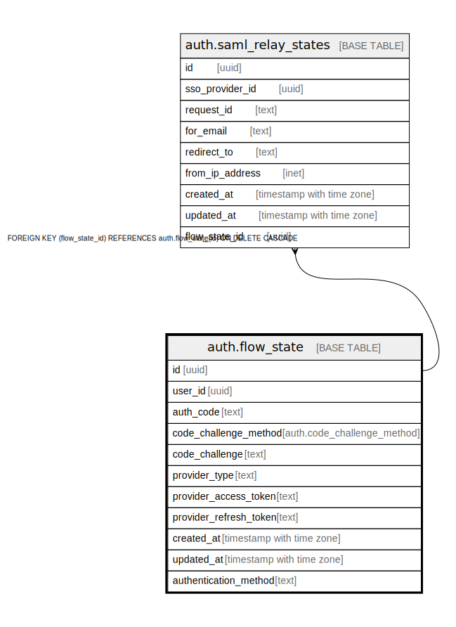

# auth.flow_state

## Description

stores metadata for pkce logins

## Columns

| Name | Type | Default | Nullable | Children | Parents | Comment |
| ---- | ---- | ------- | -------- | -------- | ------- | ------- |
| id | uuid |  | false | [auth.saml_relay_states](auth.saml_relay_states.md) |  |  |
| user_id | uuid |  | true |  |  |  |
| auth_code | text |  | false |  |  |  |
| code_challenge_method | auth.code_challenge_method |  | false |  |  |  |
| code_challenge | text |  | false |  |  |  |
| provider_type | text |  | false |  |  |  |
| provider_access_token | text |  | true |  |  |  |
| provider_refresh_token | text |  | true |  |  |  |
| created_at | timestamp with time zone |  | true |  |  |  |
| updated_at | timestamp with time zone |  | true |  |  |  |
| authentication_method | text |  | false |  |  |  |

## Constraints

| Name | Type | Definition |
| ---- | ---- | ---------- |
| flow_state_pkey | PRIMARY KEY | PRIMARY KEY (id) |

## Indexes

| Name | Definition |
| ---- | ---------- |
| flow_state_pkey | CREATE UNIQUE INDEX flow_state_pkey ON auth.flow_state USING btree (id) |
| flow_state_created_at_idx | CREATE INDEX flow_state_created_at_idx ON auth.flow_state USING btree (created_at DESC) |
| idx_auth_code | CREATE INDEX idx_auth_code ON auth.flow_state USING btree (auth_code) |
| idx_user_id_auth_method | CREATE INDEX idx_user_id_auth_method ON auth.flow_state USING btree (user_id, authentication_method) |

## Relations

---

> Generated by [tbls](https://github.com/k1LoW/tbls)
