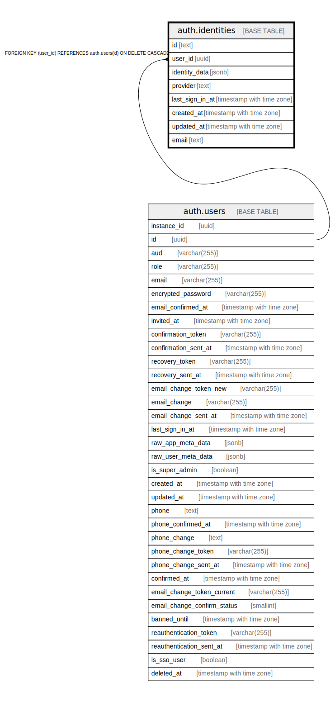

# auth.identities

## Description

Auth: Stores identities associated to a user.

## Columns

| Name | Type | Default | Nullable | Extra Definition | Children | Parents | Comment |
| ---- | ---- | ------- | -------- | ---------------- | -------- | ------- | ------- |
| id | text |  | false |  |  |  |  |
| user_id | uuid |  | false |  |  | [auth.users](auth.users.md) |  |
| identity_data | jsonb |  | false |  |  |  |  |
| provider | text |  | false |  |  |  |  |
| last_sign_in_at | timestamp with time zone |  | true |  |  |  |  |
| created_at | timestamp with time zone |  | true |  |  |  |  |
| updated_at | timestamp with time zone |  | true |  |  |  |  |
| email | text |  | true | GENERATED ALWAYS AS lower((identity_data ->> 'email'::text)) STORED |  |  | Auth: Email is a generated column that references the optional email property in the identity_data |

## Constraints

| Name | Type | Definition |
| ---- | ---- | ---------- |
| identities_pkey | PRIMARY KEY | PRIMARY KEY (provider, id) |
| identities_user_id_fkey | FOREIGN KEY | FOREIGN KEY (user_id) REFERENCES auth.users(id) ON DELETE CASCADE |

## Indexes

| Name | Definition | Comment |
| ---- | ---------- | ------- |
| identities_pkey | CREATE UNIQUE INDEX identities_pkey ON auth.identities USING btree (provider, id) |  |
| identities_email_idx | CREATE INDEX identities_email_idx ON auth.identities USING btree (email text_pattern_ops) | Auth: Ensures indexed queries on the email column |
| identities_user_id_idx | CREATE INDEX identities_user_id_idx ON auth.identities USING btree (user_id) |  |

## Relations

---

> Generated by [tbls](https://github.com/k1LoW/tbls)
