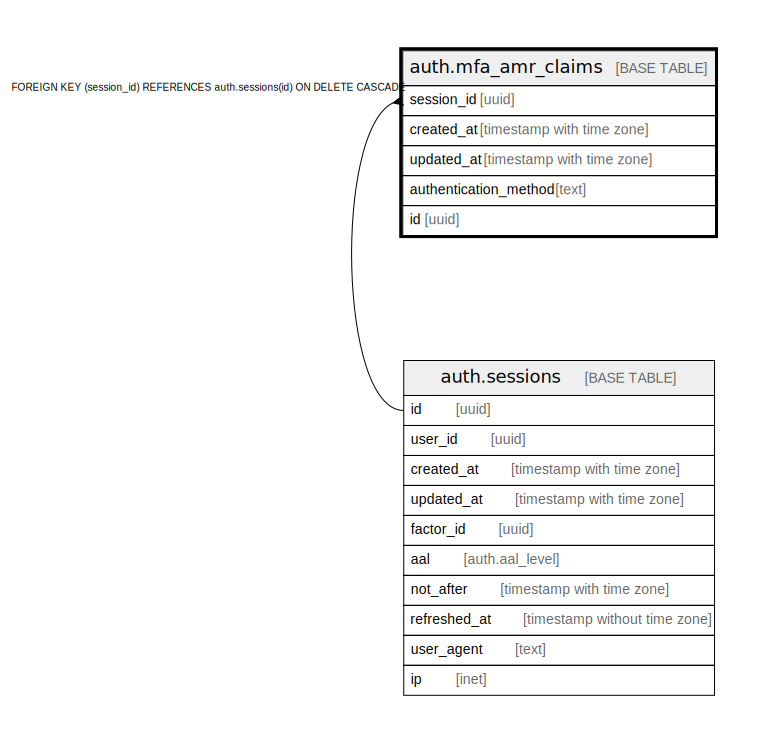

# auth.mfa_amr_claims

## Description

auth: stores authenticator method reference claims for multi factor authentication

## Columns

| Name | Type | Default | Nullable | Children | Parents | Comment |
| ---- | ---- | ------- | -------- | -------- | ------- | ------- |
| session_id | uuid |  | false |  | [auth.sessions](auth.sessions.md) |  |
| created_at | timestamp with time zone |  | false |  |  |  |
| updated_at | timestamp with time zone |  | false |  |  |  |
| authentication_method | text |  | false |  |  |  |
| id | uuid |  | false |  |  |  |

## Constraints

| Name | Type | Definition |
| ---- | ---- | ---------- |
| mfa_amr_claims_session_id_fkey | FOREIGN KEY | FOREIGN KEY (session_id) REFERENCES auth.sessions(id) ON DELETE CASCADE |
| mfa_amr_claims_session_id_authentication_method_pkey | UNIQUE | UNIQUE (session_id, authentication_method) |
| amr_id_pk | PRIMARY KEY | PRIMARY KEY (id) |

## Indexes

| Name | Definition |
| ---- | ---------- |
| mfa_amr_claims_session_id_authentication_method_pkey | CREATE UNIQUE INDEX mfa_amr_claims_session_id_authentication_method_pkey ON auth.mfa_amr_claims USING btree (session_id, authentication_method) |
| amr_id_pk | CREATE UNIQUE INDEX amr_id_pk ON auth.mfa_amr_claims USING btree (id) |

## Relations

---

> Generated by [tbls](https://github.com/k1LoW/tbls)
