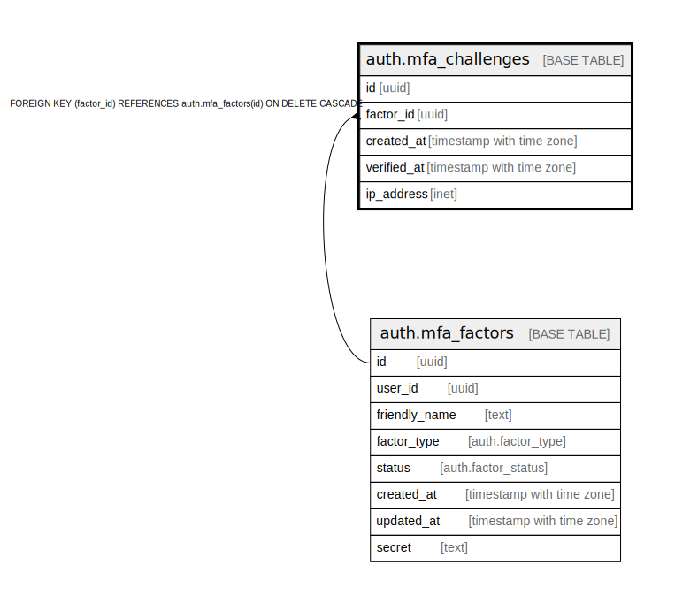

# auth.mfa_challenges

## Description

auth: stores metadata about challenge requests made

## Columns

| Name | Type | Default | Nullable | Children | Parents | Comment |
| ---- | ---- | ------- | -------- | -------- | ------- | ------- |
| id | uuid |  | false |  |  |  |
| factor_id | uuid |  | false |  | [auth.mfa_factors](auth.mfa_factors.md) |  |
| created_at | timestamp with time zone |  | false |  |  |  |
| verified_at | timestamp with time zone |  | true |  |  |  |
| ip_address | inet |  | false |  |  |  |

## Constraints

| Name | Type | Definition |
| ---- | ---- | ---------- |
| mfa_challenges_auth_factor_id_fkey | FOREIGN KEY | FOREIGN KEY (factor_id) REFERENCES auth.mfa_factors(id) ON DELETE CASCADE |
| mfa_challenges_pkey | PRIMARY KEY | PRIMARY KEY (id) |

## Indexes

| Name | Definition |
| ---- | ---------- |
| mfa_challenges_pkey | CREATE UNIQUE INDEX mfa_challenges_pkey ON auth.mfa_challenges USING btree (id) |
| mfa_challenge_created_at_idx | CREATE INDEX mfa_challenge_created_at_idx ON auth.mfa_challenges USING btree (created_at DESC) |

## Relations

---

> Generated by [tbls](https://github.com/k1LoW/tbls)
