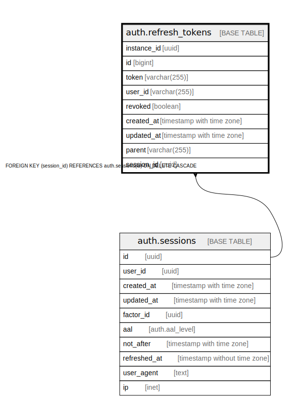

# auth.refresh_tokens

## Description

Auth: Store of tokens used to refresh JWT tokens once they expire.

## Columns

| Name | Type | Default | Nullable | Children | Parents | Comment |
| ---- | ---- | ------- | -------- | -------- | ------- | ------- |
| instance_id | uuid |  | true |  |  |  |
| id | bigint | nextval('auth.refresh_tokens_id_seq'::regclass) | false |  |  |  |
| token | varchar(255) |  | true |  |  |  |
| user_id | varchar(255) |  | true |  |  |  |
| revoked | boolean |  | true |  |  |  |
| created_at | timestamp with time zone |  | true |  |  |  |
| updated_at | timestamp with time zone |  | true |  |  |  |
| parent | varchar(255) |  | true |  |  |  |
| session_id | uuid |  | true |  | [auth.sessions](auth.sessions.md) |  |

## Constraints

| Name | Type | Definition |
| ---- | ---- | ---------- |
| refresh_tokens_pkey | PRIMARY KEY | PRIMARY KEY (id) |
| refresh_tokens_token_unique | UNIQUE | UNIQUE (token) |
| refresh_tokens_session_id_fkey | FOREIGN KEY | FOREIGN KEY (session_id) REFERENCES auth.sessions(id) ON DELETE CASCADE |

## Indexes

| Name | Definition |
| ---- | ---------- |
| refresh_tokens_pkey | CREATE UNIQUE INDEX refresh_tokens_pkey ON auth.refresh_tokens USING btree (id) |
| refresh_tokens_instance_id_idx | CREATE INDEX refresh_tokens_instance_id_idx ON auth.refresh_tokens USING btree (instance_id) |
| refresh_tokens_instance_id_user_id_idx | CREATE INDEX refresh_tokens_instance_id_user_id_idx ON auth.refresh_tokens USING btree (instance_id, user_id) |
| refresh_tokens_token_unique | CREATE UNIQUE INDEX refresh_tokens_token_unique ON auth.refresh_tokens USING btree (token) |
| refresh_tokens_parent_idx | CREATE INDEX refresh_tokens_parent_idx ON auth.refresh_tokens USING btree (parent) |
| refresh_tokens_session_id_revoked_idx | CREATE INDEX refresh_tokens_session_id_revoked_idx ON auth.refresh_tokens USING btree (session_id, revoked) |
| refresh_tokens_updated_at_idx | CREATE INDEX refresh_tokens_updated_at_idx ON auth.refresh_tokens USING btree (updated_at DESC) |

## Relations

---

> Generated by [tbls](https://github.com/k1LoW/tbls)
