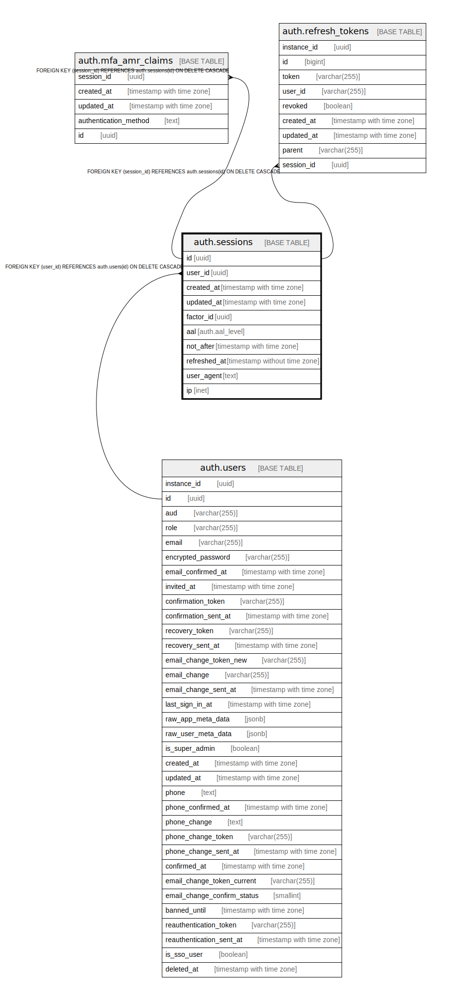

# auth.sessions

## Description

Auth: Stores session data associated to a user.

## Columns

| Name | Type | Default | Nullable | Children | Parents | Comment |
| ---- | ---- | ------- | -------- | -------- | ------- | ------- |
| id | uuid |  | false | [auth.refresh_tokens](auth.refresh_tokens.md) [auth.mfa_amr_claims](auth.mfa_amr_claims.md) |  |  |
| user_id | uuid |  | false |  | [auth.users](auth.users.md) |  |
| created_at | timestamp with time zone |  | true |  |  |  |
| updated_at | timestamp with time zone |  | true |  |  |  |
| factor_id | uuid |  | true |  |  |  |
| aal | auth.aal_level |  | true |  |  |  |
| not_after | timestamp with time zone |  | true |  |  | Auth: Not after is a nullable column that contains a timestamp after which the session should be regarded as expired. |

## Constraints

| Name | Type | Definition |
| ---- | ---- | ---------- |
| sessions_user_id_fkey | FOREIGN KEY | FOREIGN KEY (user_id) REFERENCES auth.users(id) ON DELETE CASCADE |
| sessions_pkey | PRIMARY KEY | PRIMARY KEY (id) |

## Indexes

| Name | Definition |
| ---- | ---------- |
| sessions_pkey | CREATE UNIQUE INDEX sessions_pkey ON auth.sessions USING btree (id) |
| user_id_created_at_idx | CREATE INDEX user_id_created_at_idx ON auth.sessions USING btree (user_id, created_at) |
| sessions_user_id_idx | CREATE INDEX sessions_user_id_idx ON auth.sessions USING btree (user_id) |
| sessions_not_after_idx | CREATE INDEX sessions_not_after_idx ON auth.sessions USING btree (not_after DESC) |

## Relations

---

> Generated by [tbls](https://github.com/k1LoW/tbls)
