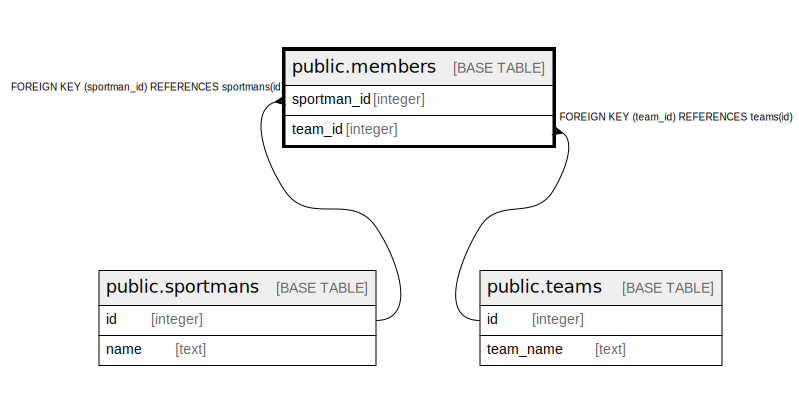

# public.members

## Description

## Columns

| Name | Type | Default | Nullable | Children | Parents | Comment |
| ---- | ---- | ------- | -------- | -------- | ------- | ------- |
| sportman_id | integer |  | false |  | [public.sportmans](public.sportmans.md) |  |
| team_id | integer |  | false |  | [public.teams](public.teams.md) |  |

## Constraints

| Name | Type | Definition |
| ---- | ---- | ---------- |
| members_pkey | PRIMARY KEY | PRIMARY KEY (sportman_id, team_id) |
| members_sportman_id_fkey | FOREIGN KEY | FOREIGN KEY (sportman_id) REFERENCES sportmans(id) |
| members_team_id_fkey | FOREIGN KEY | FOREIGN KEY (team_id) REFERENCES teams(id) |

## Indexes

| Name | Definition |
| ---- | ---------- |
| members_pkey | CREATE UNIQUE INDEX members_pkey ON public.members USING btree (sportman_id, team_id) |

## Relations

---

> Generated by [tbls](https://github.com/k1LoW/tbls)
