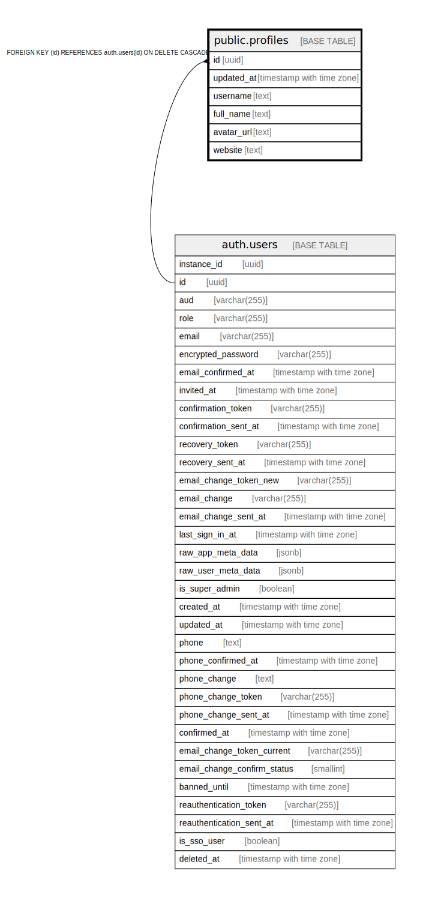

# public.profiles

## Description

## Columns

| Name | Type | Default | Nullable | Children | Parents | Comment |
| ---- | ---- | ------- | -------- | -------- | ------- | ------- |
| id | uuid |  | false |  | [auth.users](auth.users.md) |  |
| updated_at | timestamp with time zone |  | true |  |  |  |
| username | text |  | true |  |  |  |
| full_name | text |  | true |  |  |  |
| avatar_url | text |  | true |  |  |  |
| website | text |  | true |  |  |  |

## Constraints

| Name | Type | Definition |
| ---- | ---- | ---------- |
| username_length | CHECK | CHECK ((char_length(username) >= 3)) |
| profiles_id_fkey | FOREIGN KEY | FOREIGN KEY (id) REFERENCES auth.users(id) ON DELETE CASCADE |
| profiles_pkey | PRIMARY KEY | PRIMARY KEY (id) |
| profiles_username_key | UNIQUE | UNIQUE (username) |

## Indexes

| Name | Definition |
| ---- | ---------- |
| profiles_pkey | CREATE UNIQUE INDEX profiles_pkey ON public.profiles USING btree (id) |
| profiles_username_key | CREATE UNIQUE INDEX profiles_username_key ON public.profiles USING btree (username) |

## Relations

---

> Generated by [tbls](https://github.com/k1LoW/tbls)
