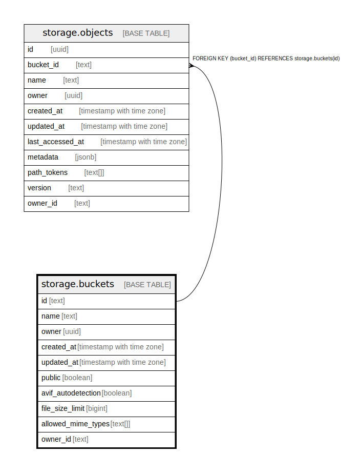

# storage.buckets

## Description

## Columns

| Name | Type | Default | Nullable | Children | Parents | Comment |
| ---- | ---- | ------- | -------- | -------- | ------- | ------- |
| id | text |  | false | [storage.objects](storage.objects.md) |  |  |
| name | text |  | false |  |  |  |
| owner | uuid |  | true |  |  | Field is deprecated, use owner_id instead |
| created_at | timestamp with time zone | now() | true |  |  |  |
| updated_at | timestamp with time zone | now() | true |  |  |  |
| public | boolean | false | true |  |  |  |
| avif_autodetection | boolean | false | true |  |  |  |
| file_size_limit | bigint |  | true |  |  |  |
| allowed_mime_types | text[] |  | true |  |  |  |
| owner_id | text |  | true |  |  |  |

## Constraints

| Name | Type | Definition |
| ---- | ---- | ---------- |
| buckets_pkey | PRIMARY KEY | PRIMARY KEY (id) |

## Indexes

| Name | Definition |
| ---- | ---------- |
| buckets_pkey | CREATE UNIQUE INDEX buckets_pkey ON storage.buckets USING btree (id) |
| bname | CREATE UNIQUE INDEX bname ON storage.buckets USING btree (name) |

## Relations

---

> Generated by [tbls](https://github.com/k1LoW/tbls)
