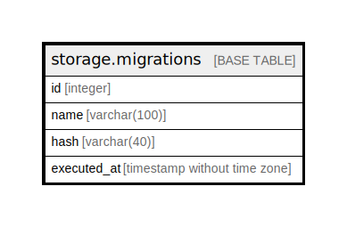

# storage.migrations

## Description

## Columns

| Name | Type | Default | Nullable | Children | Parents | Comment |
| ---- | ---- | ------- | -------- | -------- | ------- | ------- |
| id | integer |  | false |  |  |  |
| name | varchar(100) |  | false |  |  |  |
| hash | varchar(40) |  | false |  |  |  |
| executed_at | timestamp without time zone | CURRENT_TIMESTAMP | true |  |  |  |

## Constraints

| Name | Type | Definition |
| ---- | ---- | ---------- |
| migrations_name_key | UNIQUE | UNIQUE (name) |
| migrations_pkey | PRIMARY KEY | PRIMARY KEY (id) |

## Indexes

| Name | Definition |
| ---- | ---------- |
| migrations_name_key | CREATE UNIQUE INDEX migrations_name_key ON storage.migrations USING btree (name) |
| migrations_pkey | CREATE UNIQUE INDEX migrations_pkey ON storage.migrations USING btree (id) |

## Relations

---

> Generated by [tbls](https://github.com/k1LoW/tbls)
