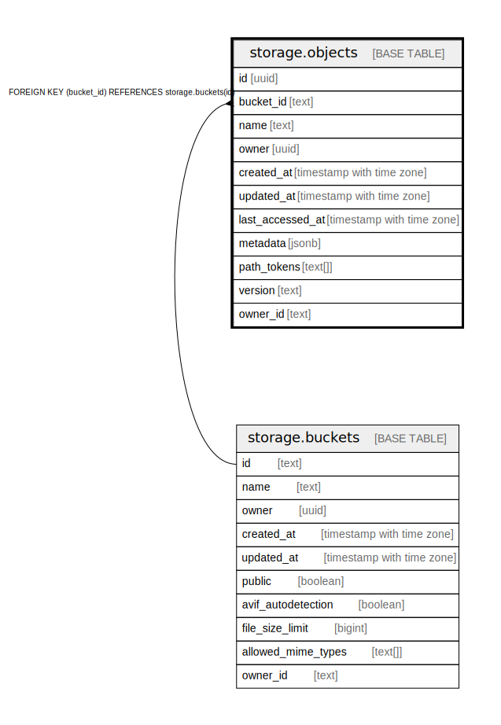

# storage.objects

## Description

## Columns

| Name | Type | Default | Nullable | Extra Definition | Children | Parents | Comment |
| ---- | ---- | ------- | -------- | ---------------- | -------- | ------- | ------- |
| id | uuid | uuid_generate_v4() | false |  |  |  |  |
| bucket_id | text |  | true |  |  | [storage.buckets](storage.buckets.md) |  |
| name | text |  | true |  |  |  |  |
| owner | uuid |  | true |  |  |  | Field is deprecated, use owner_id instead |
| created_at | timestamp with time zone | now() | true |  |  |  |  |
| updated_at | timestamp with time zone | now() | true |  |  |  |  |
| last_accessed_at | timestamp with time zone | now() | true |  |  |  |  |
| metadata | jsonb |  | true |  |  |  |  |
| path_tokens | text[] |  | true | GENERATED ALWAYS AS string_to_array(name, '/'::text) STORED |  |  |  |
| version | text |  | true |  |  |  |  |
| owner_id | text |  | true |  |  |  |  |

## Constraints

| Name | Type | Definition |
| ---- | ---- | ---------- |
| objects_bucketId_fkey | FOREIGN KEY | FOREIGN KEY (bucket_id) REFERENCES storage.buckets(id) |
| objects_pkey | PRIMARY KEY | PRIMARY KEY (id) |

## Indexes

| Name | Definition |
| ---- | ---------- |
| objects_pkey | CREATE UNIQUE INDEX objects_pkey ON storage.objects USING btree (id) |
| bucketid_objname | CREATE UNIQUE INDEX bucketid_objname ON storage.objects USING btree (bucket_id, name) |
| name_prefix_search | CREATE INDEX name_prefix_search ON storage.objects USING btree (name text_pattern_ops) |

## Triggers

| Name | Definition |
| ---- | ---------- |
| update_objects_updated_at | CREATE TRIGGER update_objects_updated_at BEFORE UPDATE ON storage.objects FOR EACH ROW EXECUTE FUNCTION storage.update_updated_at_column() |

## Relations

---

> Generated by [tbls](https://github.com/k1LoW/tbls)
